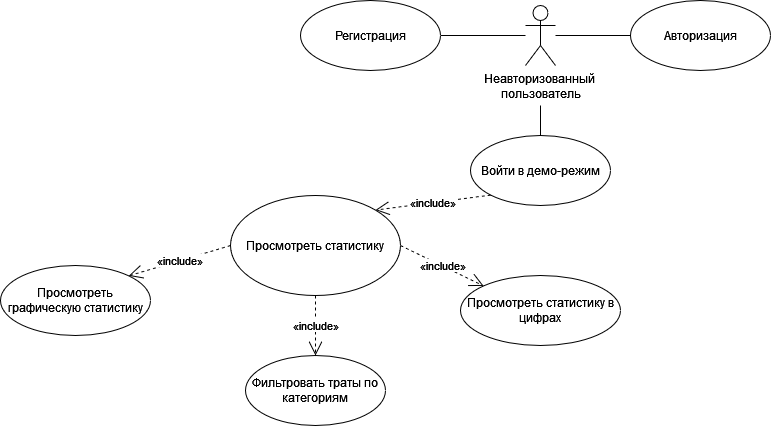
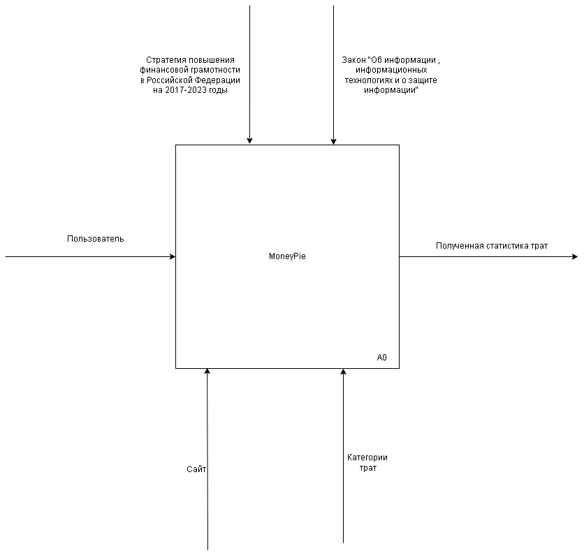
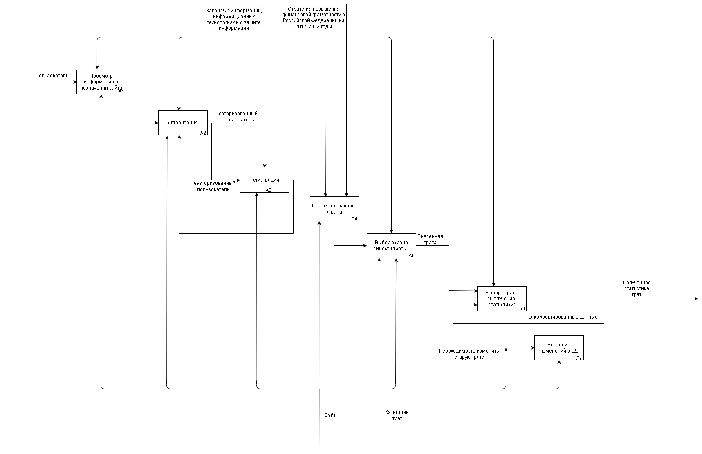

# Диаграммы 
### Диаграмма прецендентов для неавторизованного пользователя

### Диаграмма прецендентов для приглашенного пользователя

### Диаграмма прецендентов для авторизованного пользователя

### Диаграмма активностей

### Диаграмма состояния пользователя 

### Диаграмма состояния группы

### Диаграмма последовательности авторизованного пользователя

### Диаграмма последовательности неавторизованного пользователя 

### Диаграмма IDEF0 0 уровень 

### Диаграмма IDEF0 1 уровень

### Диаграмма развертывания

### Диаграмма сотруднечества авторизации

### Диаграмма сотруднечества трат

### Диаграмма сотруднечества статистики

[Вернуться к readme](README.md) 