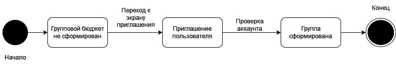
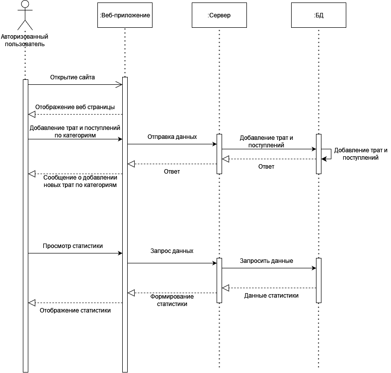
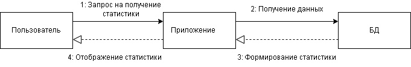
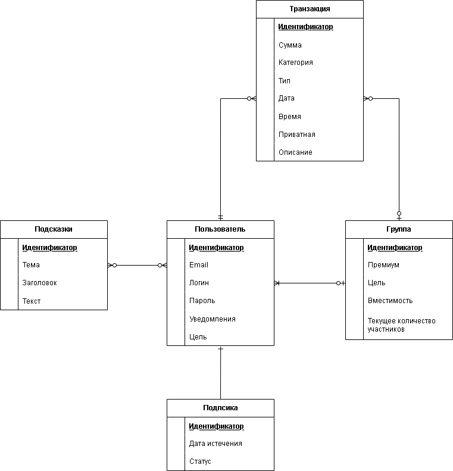

# Диаграммы
### Диаграмма прецендентов для неавторизованного пользователя

### Диаграмма прецендентов для авторизованного пользователя

### Диаграмма активностей

### Диаграмма состояния пользователя

### Диаграмма состояния группы

### Диаграмма последовательности авторизованного пользователя

### Диаграмма последовательности неавторизованного пользователя

### Диаграмма IDEF0 0 уровень

### Диаграмма IDEF0 1 уровень

### Диаграмма развертывания

### Диаграмма сотруднечества авторизации

### Диаграмма сотруднечества трат

### Диаграмма сотруднечества статистики

### ER-диаграмма базы данных

### Физическая схема базы данных

[Вернуться к readme](README.md)
